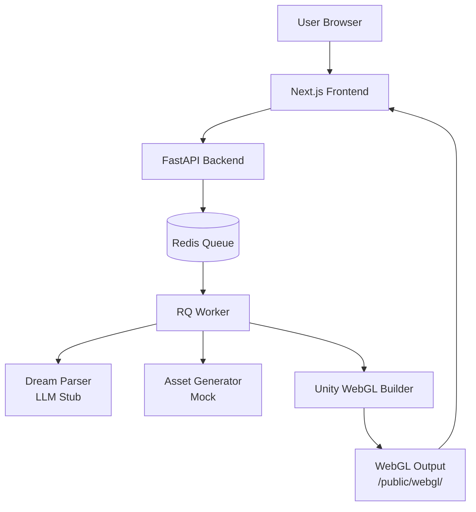

# 🏗️ DreamQuest Architecture

## System Overview

DreamQuest is a full-stack monorepo application that transforms dream descriptions into playable WebGL worlds through a multi-stage pipeline.



## Architecture Layers

### 1. Frontend Layer (Next.js 15)

**Technology:** Next.js 15 App Router, React 19, TypeScript, Tailwind CSS

**Responsibilities:**
- User interface for dream input (text/audio)
- Form validation with Zod
- Real-time job progress polling
- WebGL world viewer (iframe)
- State management with Zustand
- Responsive design with Tailwind + shadcn/ui

**Key Components:**

```
app/
├── page.tsx                 # Homepage
├── dreamquest/
│   ├── page.tsx            # Main dream input + viewer
│   ├── gallery/page.tsx    # Public gallery (future)
│   └── play/[jobId]/page.tsx # Shareable world viewer
components/
├── DreamForm.tsx           # Form with validation
├── JobProgress.tsx         # Real-time status tracker
├── WebGLViewer.tsx         # WebGL iframe wrapper
├── DreamHistory.tsx        # User's past dreams
└── ui/                     # shadcn/ui components
lib/
├── api.ts                  # API client + SSE polling
├── store.ts                # Zustand state management
└── validations.ts          # Zod schemas
```

**Data Flow:**

1. User fills form → Zod validation
2. `createJob()` API call → returns `jobId`
3. Store `jobId` in Zustand
4. `pollJob()` generator polls every 1s
5. Update progress bar until `status = ready`
6. Render WebGL iframe

### 2. Backend Layer (FastAPI)

**Technology:** FastAPI, Pydantic v2, Redis (async), Uvicorn

**Responsibilities:**
- REST API endpoints
- Request validation with Pydantic
- Job creation and tracking
- Rate limiting (3 jobs/anonymous, 10/authenticated)
- CORS handling

**API Endpoints:**

| Method | Endpoint | Description |
|--------|----------|-------------|
| POST | `/v1/jobs` | Create new dream generation job |
| GET | `/v1/jobs/{jobId}` | Get job status and result |
| GET | `/v1/jobs/{jobId}/blueprint` | Get JSON blueprint for Unity |
| POST | `/v1/transcribe` | Transcribe audio to text (stub) |
| GET | `/health` | Health check |

**Pydantic Schemas:**

```python
# Input
CreateJobRequest:
  - dream_text?: string (30-2000 chars)
  - audio_url?: string
  - style: "lowpoly" | "realistic" | "toon" | "surreal"
  - mood: "calm" | "tense" | "mystic" | "nostalgic"
  - length: "short" | "long"
  - user_id?: string

# Output
GetJobResponse:
  - job_id: UUID
  - status: "queued" | "analyzing" | "generating" | "building" | "ready" | "failed"
  - progress: int (0-100)
  - result?: JobResult
  - error?: string

JobResult:
  - webgl_url: string
  - blueprint: Blueprint
```

**Storage:** Redis for job state + progress

```
Key: job:{uuid}
Value: JSON {
  job_id, status, progress, dream_text, style, mood,
  result: { webgl_url, blueprint }
}
TTL: 24h
```

### 3. Worker Layer (RQ + Redis)

**Technology:** Python RQ (Redis Queue), Redis

**Responsibilities:**
- Asynchronous dream processing
- Multi-stage pipeline orchestration
- Job progress updates
- Error handling and retries

**Pipeline Stages:**

```python
# workers/orchestrator.py

def process_dream(job_id):
    # Stage A: Analyzing (25%)
    blueprint = parse_dream_to_blueprint(dream_text, style, mood)

    # Stage B: Generating (50%)
    assets = generate_assets_mock(blueprint)

    # Stage C: Building (75%)
    webgl_url = build_webgl_world(job_id, blueprint)

    # Stage D: Ready (100%)
    update_job_status(job_id, "ready", 100, result={
        webgl_url, blueprint
    })
```

**Stage A: Dream Parsing (LLM)**

Current: Deterministic keyword-based stub
Future: OpenAI/Anthropic API call

```python
# Stub logic
if "forest" in dream_text: world = "forest"
if "night" in dream_text: time = "night"
if "bird" in dream_text: characters.append("bird")
```

Output: Blueprint JSON

```json
{
  "world": "forest",
  "time": "night",
  "weather": "feathers_rain",
  "goal": "follow_bird_to_flying_house",
  "characters": [
    {"type": "bird", "role": "guide"},
    {"type": "house", "float": true}
  ],
  "style": "lowpoly",
  "mood": "mystic"
}
```

**Stage B: Asset Generation (Mock)**

Current: Returns mock asset paths
Future: SDXL for images, procedural generators

**Stage C: WebGL Build**

Current: Creates blueprint.json in `/public/webgl/{jobId}/`
Future: Trigger Unity Cloud Build or local build script

### 4. Unity Layer (WebGL)

**Technology:** Unity 2022.3 LTS, C#

**Responsibilities:**
- Runtime blueprint loading
- Dynamic scene construction
- Lighting and weather effects
- Character and object instantiation
- First-person controller

**Blueprint Loader (C#):**

```csharp
// unity/Assets/Scripts/BlueprintLoader.cs

public class BlueprintLoader : MonoBehaviour {
    void Start() {
        LoadBlueprint(blueprintUrl);
    }

    void BuildWorld() {
        ConfigureLighting();      // Based on time + mood
        ConfigureWeather();       // Particles for rain/fog
        InstantiateTerrain();     // World type
        InstantiateCharacters();  // NPCs and objects
    }
}
```

**Lighting Configuration:**

| Time | Intensity | Color | Fog |
|------|-----------|-------|-----|
| night | 0.3 | Blue tint | Yes |
| day | 1.0 | White | No |
| sunset | 0.7 | Orange | Mild |

**Mood Effects:**

| Mood | Fog Color | Fog Density |
|------|-----------|-------------|
| mystic | Purple | 0.02 |
| calm | Light blue | 0.01 |
| tense | Dark red | 0.03 |
| nostalgic | Sepia | 0.015 |

**WebGL Export:**

1. File → Build Settings → WebGL
2. Compression: Gzip (or Disabled for dev)
3. Output: `/frontend/public/webgl/{jobId}/`
4. Generates:
   - `index.html`
   - `Build/Build.wasm`, `.data`, `.framework.js`, `.loader.js`

### 5. Infrastructure Layer

**Docker Services:**

```yaml
services:
  redis:       # Job queue + cache
  api:         # FastAPI backend (port 8000)
  worker:      # RQ background worker
  frontend:    # Next.js (port 3000)
  nginx:       # Reverse proxy (port 80)
```

**Production Setup:**

- **Frontend:** Vercel (automatic deployment from GitHub)
- **API:** Render/Railway (auto-scaling)
- **Worker:** Render Background Worker
- **Redis:** Render Redis or Upstash
- **Storage:** Vercel for static WebGL files

## Data Flow Diagram

```
User Input
    ↓
[DreamForm] → Validation (Zod)
    ↓
POST /v1/jobs
    ↓
[FastAPI] → Create job in Redis → Enqueue RQ task
    ↓                                      ↓
Return jobId                          [Worker]
    ↓                                      ↓
[JobProgress] ← Poll GET /v1/jobs/{id} ← Update status in Redis
    |                                      |
    |  Status: analyzing → generating → building → ready
    |                                      |
    └──────────────────────────────────────┘
                    ↓
            [WebGLViewer]
```

## Security Considerations

### Input Sanitization

- All user input sanitized for XSS
- Dream text: max 2000 chars
- Audio files: max 30 MB
- File type validation (MP3, WAV only)

### Rate Limiting

- Anonymous: 3 concurrent jobs
- Authenticated: 10 concurrent jobs
- Implemented via Redis counters

### CORS Policy

- Strict origin whitelist
- Configurable via `CORS_ORIGINS` env var

### Authentication (Future)

- Supabase Auth integration
- JWT tokens for API access
- Row-level security for user data

## Scalability

### Horizontal Scaling

- **Frontend:** CDN + edge caching (Vercel)
- **API:** Stateless, can add replicas
- **Workers:** Can run multiple RQ workers
- **Redis:** Redis Cluster for high availability

### Caching Strategy

- Job results: 24h TTL in Redis
- WebGL builds: Permanent storage, CDN cached
- API responses: ETags for conditional requests

### Performance Optimizations

- **Frontend:**
  - Code splitting (Next.js automatic)
  - Image optimization (next/image)
  - Lazy loading for WebGL iframe

- **Backend:**
  - Async I/O (FastAPI + Redis asyncio)
  - Connection pooling
  - Response compression (gzip)

- **Unity:**
  - Texture atlases
  - LOD (Level of Detail) systems
  - Asset bundling
  - Target 60 FPS on mid-range hardware

## Monitoring & Observability

### Metrics to Track

- Job completion rate
- Average processing time per stage
- Error rates (by stage)
- API response times
- WebGL load times

### Logging

- **Frontend:** Vercel Analytics
- **Backend:** Structured JSON logs (FastAPI)
- **Workers:** RQ job logs in Redis

### Error Handling

- All stages wrapped in try/catch
- Failed jobs: `status = failed`, `error` message
- Retry logic in RQ (max 3 retries)

## Extension Points

### Adding New AI Services

**LLM Integration:**
```python
# workers/orchestrator.py
def parse_dream_to_blueprint(dream_text, style, mood):
    # Replace stub with:
    response = openai.ChatCompletion.create(
        model="gpt-4",
        messages=[{"role": "user", "content": prompt}]
    )
    return json.loads(response.choices[0].message.content)
```

**Image Generation:**
```python
def generate_assets(blueprint):
    # SDXL API call
    for character in blueprint["characters"]:
        image = sdxl.generate(prompt=f"{character['type']} {style}")
        save(image, f"/assets/{character['type']}.png")
```

**Audio Transcription:**
```python
def transcribe_audio(audio_url):
    # Whisper API
    audio = download(audio_url)
    text = whisper.transcribe(audio)
    return text
```

### Adding Authentication

1. Install Supabase client
2. Protect routes with middleware
3. Store `user_id` in job data
4. Filter jobs by user in history

### Adding Gallery

1. New table: `public_dreams`
2. Flag jobs as public/private
3. Gallery page fetches public jobs
4. Thumbnail generation from WebGL

## Future Architecture Considerations

### Microservices Split

If scaling beyond monolith:

```
dreamquest/
  /auth-service       # User auth (Supabase/Auth0)
  /dream-service      # LLM parsing
  /asset-service      # Image/audio generation
  /build-service      # Unity builds
  /gateway            # API Gateway (Kong/nginx)
```

### Event-Driven Architecture

Replace RQ with Kafka/RabbitMQ for:
- Better fault tolerance
- Event replay
- Multiple consumers

### Database Migration

Move from Redis to:
- PostgreSQL for persistent job data
- Redis for cache only
- S3/R2 for WebGL file storage

## Development Workflow

1. **Feature branch** → `feature/my-feature`
2. **Local dev** → `npm run dev` + `uvicorn main:app --reload`
3. **Tests** → `npm test` + `pytest`
4. **PR** → CI runs lint + tests
5. **Merge to main** → Auto-deploy to staging
6. **Manual promotion** → Deploy to production

---

**Last Updated:** 2025-01-06
